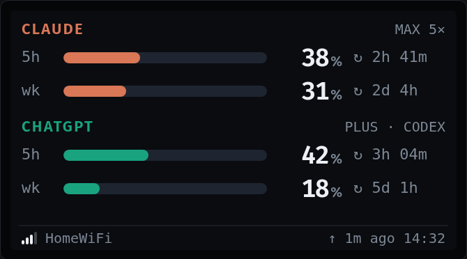
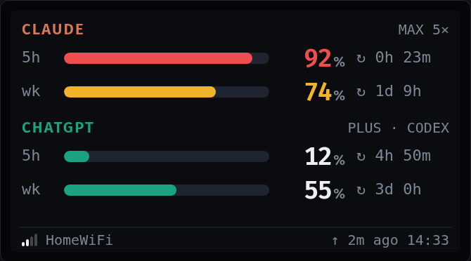
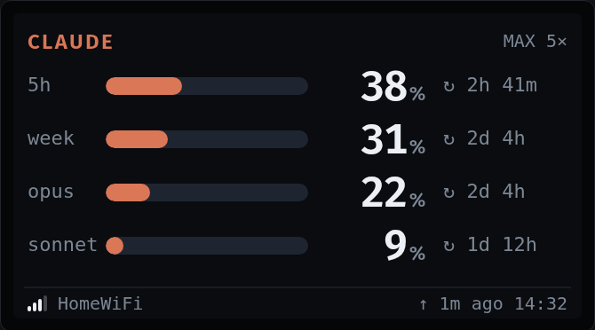
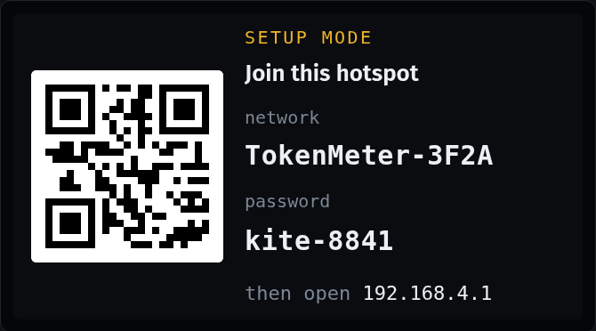
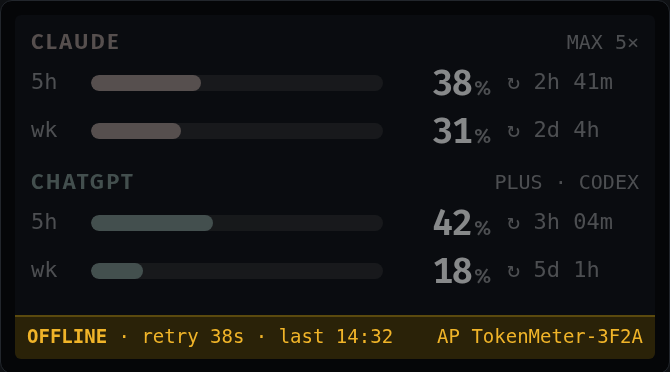
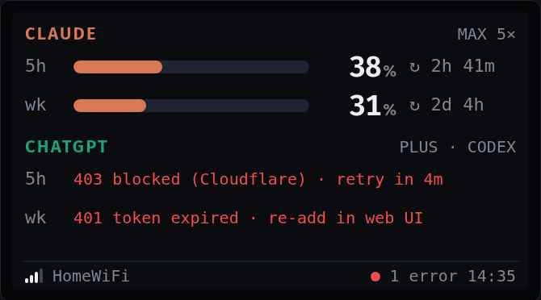
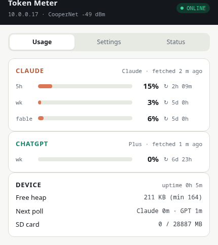
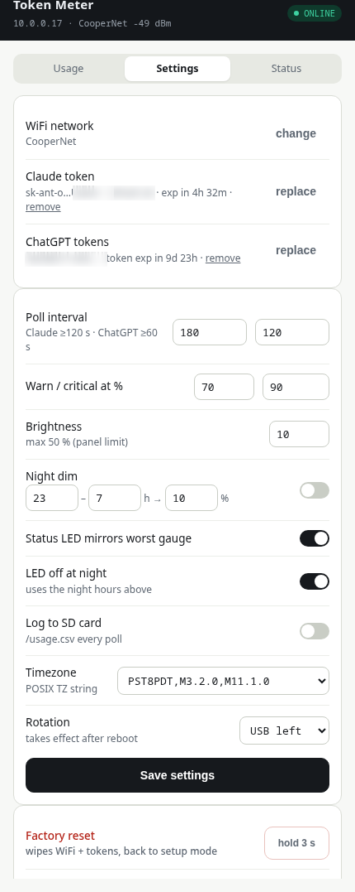
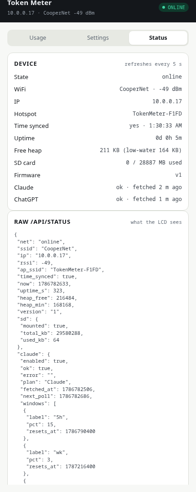

# Token Meter

A tiny desk gauge for your AI subscriptions. An **ESP32‑C6** with a 1.47″ LCD (Waveshare
ESP32‑C6‑LCD‑1.47) that polls the usage endpoints of **Claude Pro/Max** and **ChatGPT/Codex** and
shows how much of each rate‑limit window you have burned — with reset countdowns, warning colours,
and a status LED you can read from across the room. Everything runs on the device; you configure it
from your phone through a web UI.

<p align="center">
  
</p>

## What it does

- **Two providers, four bars** — Claude 5‑hour + weekly, ChatGPT 5‑hour + weekly, each with %, bar and “resets in”.
- **Only what you configured is drawn.** Skip a provider and the other takes the whole panel (bigger
  numbers, plus Claude’s per‑model weekly limits such as Opus / Sonnet / Fable).
- **Thresholds** — bar and number turn amber at 70 %, red at 90 % (both adjustable). The onboard
  WS2812 mirrors the worst gauge; it goes dark at night on a schedule you set.
- **Zero‑config first boot** — the LCD shows a hotspot name, password and a Wi‑Fi QR code; join it and
  a captive portal walks you through Wi‑Fi → Claude → ChatGPT in three steps.
- **Fallback mode** — if your Wi‑Fi disappears the last data stays on screen (greyed) with an OFFLINE
  banner, the hotspot comes back so you can fix the password, and it keeps retrying in the background.
- **Web UI on your LAN** — `http://tokenmeter.local`: usage mirror, settings (poll intervals,
  thresholds, brightness, night dim, LED, time zone, rotation, SD logging), status/diagnostics, factory reset.
- Optional CSV history to the TF card.

## Screens

Design renders (320 × 172 px, drawn 2×) — the LVGL build reproduces these 1:1.

| | |
|---|---|
|  <br> **Dashboard** — the resting state |  <br> **Warning + critical** — only the bar and number change hue; LED goes red |
|  <br> **Single provider** — an unconfigured provider is never drawn; the other gets taller rows and per‑model limits |  <br> **Setup mode** — first boot; scan the QR to join, captive portal opens the wizard |
|  <br> **Offline fallback** — last data stays, banner names the hotspot, background retries every 30 s |  <br> **Provider error** — per‑row messages that say what to do; the other provider is unaffected |

The full interactive design page (all states, a live threshold sandbox, the LVGL token table) is
[`design/ui-samples.html`](design/ui-samples.html).

## Web UI

Screenshots from the running device.

| Usage | Settings | Status |
|---|---|---|
|  |  |  |

## Hardware

- [Waveshare ESP32‑C6‑LCD‑1.47](https://www.waveshare.com/wiki/ESP32-C6-LCD-1.47) (ST7789V3 172×320, TF slot, WS2812) — the non‑touch variant.
- Any TF card (optional; only used for CSV logging).
- Nothing else. Power over USB‑C.

## Build & flash

Requires ESP‑IDF 6.0 (5.4+ should work). See [`firmware/README.md`](firmware/README.md) for
the module layout, REST API and bench notes.

```sh
source ~/esp/esp-idf/export.sh
cd firmware
idf.py set-target esp32c6        # first time: downloads LVGL, esp_lvgl_port, led_strip, mdns, cjson
idf.py build
idf.py -p /dev/ttyACM0 flash monitor
```

## First‑time setup

1. Power the board. The LCD shows **SETUP MODE** with `TokenMeter‑XXXX`, a password and a QR code.
2. Join that hotspot from your phone; the portal opens (or browse to `http://192.168.4.1`).
3. **Wi‑Fi** — pick your 2.4 GHz network, enter the password, *Test & continue*.
4. **Claude** — paste the contents of `~/.claude/.credentials.json` (macOS: `security find-generic-password -s "Claude Code-credentials" -w`).
   This is Claude Code’s own login token; it carries the `user:profile` scope the usage endpoint needs.
   A `claude setup-token` token does **not** work (403).
5. **ChatGPT** — `codex login` once on your computer, then paste `~/.codex/auth.json`. Or *Skip*.
6. *Finish*. The hotspot turns off and the dashboard appears. From now on the UI lives at `http://tokenmeter.local`.

## How it gets the numbers (and the caveats)

Both endpoints are the ones the official CLIs use for `/usage` and `/status`. Neither is documented,
and either could change — when that happens the affected row shows an error and the rest keeps working.

| | Endpoint | Auth on the device |
|---|---|---|
| Claude | `GET api.anthropic.com/api/oauth/usage` (needs a `claude-code/…` User‑Agent; poll ≥ 180 s) | Claude Code login token (access ~8 h) + refresh token (~28 d); the device refreshes itself |
| ChatGPT | `GET chatgpt.com/backend-api/wham/usage` (behind Cloudflare; the C6 passes from a home IP) | Codex CLI tokens; refresh tokens rotate, the device persists the new one immediately |

Because the device and your desktop CLI share a refresh token, one of them may occasionally be
asked to log in again — if that happens, re‑paste the file in Settings. Tokens are stored in the
ESP32’s NVS in the clear (this is an MVP; the device sits on your LAN).

## Repo layout

```
design/   ui-samples.html — the design spec: every LCD state, web mockups, LVGL tokens
docs/     PLAN.md (research + architecture), img/ (renders + screenshots)
firmware/ ESP‑IDF project (see firmware/README.md)
```
